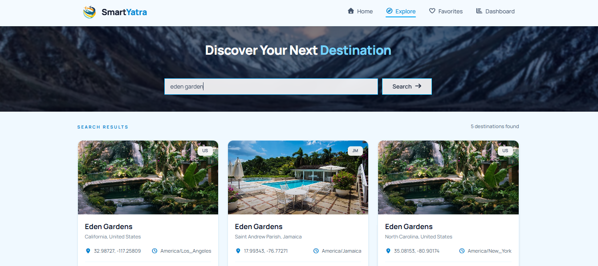
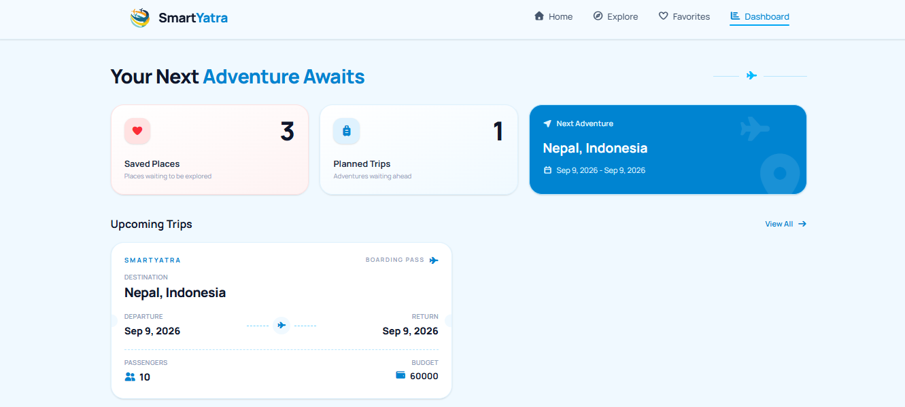

# SmartYatra

SmartYatra is a React-based travel planning web application that helps users discover destinations, access useful travel information, save favorite places, plan trips, and manage their journeys through a personal dashboard.

## Live Demo

https://smart-yaatra.vercel.app/

## Features

- Destination search and exploration
- Detailed destination information
- Current weather and weather forecast
- Interactive maps and location information
- Currency conversion
- Favorite destinations
- Trip planning and management
- Personal travel dashboard

## Tech Stack

- React
- JavaScript
- Vite
- Tailwind CSS
- React Router
- Font Awesome
- Fetch API
- localStorage

## APIs & Services

- **Open-Meteo Geocoding API** — destination search and location data
- **Open-Meteo Weather API** — current weather and forecast
- **Pexels API** — destination images
- **Frankfurter API** — currency conversion
- **Leaflet** — interactive destination maps

## Getting Started

Clone the repository:

```bash
git clone https://github.com/leosum1t/SmartTrip.git
```

Navigate to the project:

```bash
cd smarttrip
```

Install dependencies:

```bash
npm install
```

Create a `.env` file in the project root:

```env
VITE_PEXELS_API_KEY=your_pexels_api_key
```

Start the development server:

```bash
npm run dev
```

## Production Build

```bash
npm run build
npm run preview
```

## Deployment

SmartYatra is deployed on Vercel.

**Live Application:** https://smart-yaatra.vercel.app/

## Future Improvements

- User authentication
- Cloud-based storage
- Personalized destination recommendations
- Hotel and flight information
- Advanced trip budgeting

## Author

**Sumit Pokharel**

GitHub: https://github.com/leosum1t

## Screenshots

### Home


### Explore



### Destination Details


### Dashboard

